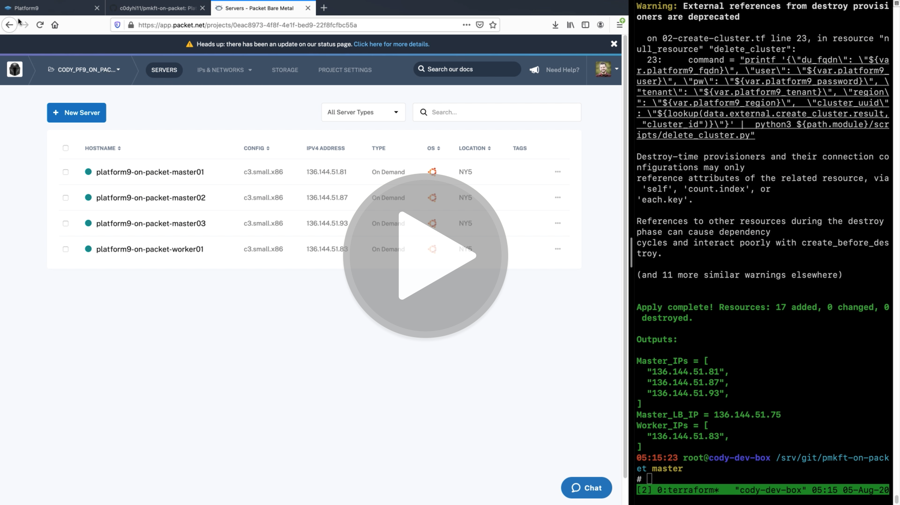
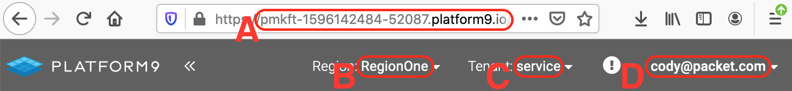

# Platform9 Managed Kubernetes on Equinix Metal

[](https://drive.google.com/file/d/1qGSSWqIxOLRodfkobgHz0e2su8f1ikoY/view)

This repo has [Terraform](http://terraform.io) plans to deploy a single-master Kubernetes Cluster on Baremetal utilizing [Platform9 Managed Kubernetes](https://platform9.com/managed-kubernetes/) and [Equinix Metal (an Equinix Company)](https://metal.equinix.com). This deployment usually takes about 15 minutes to complete, and you'll have a Managed Kubernetes cluster ready to deploy workloads. Checkout the three and a half minute video above of this deployment!

This repository is [Experimental](https://github.com/packethost/standards/blob/master/experimental-statement.md) meaning that it's based on untested ideas or techniques and not yet established or finalized or involves a radically new and innovative style! This means that support is best effort (at best!) and we strongly encourage you to NOT use this in production.

## Instructions

### Create your Equinix Metal account

1. Sign up for a [Equinix Metal Public Cloud account](https://metal.equinix.com/start/)
2. Verify your e-mail address and login
3. Follow the wizard [Getting Started with Equinix Metal](https://metal.equinix.com/start/) at  that guides you through creating a project.
    * You will need to put a Credit Card or PayPal on file, but use Promo Code ***PMKFT*** for $100 in free credits
    * This deployment will cost around $0.50 per hour.
4. [Upload an SSH key](https://metal.equinix.com/developers/docs/accounts/ssh-keys/) to your Equinix Metal account.
5. Generate and Record a [Equinix Metal API Key](https://metal.equinix.com/developers/api/) for future use
6. Locate and Record your [Equinix Metal Organization ID](https://console.equinix.com/login/) for future use
    * Located under the **Settings** section of the **Top Right Drop Down Menu**

### Sign up for the Platform9 Managed Kubernetes (PMK) Free Tier

1. Sign up for a [Platform9 PMK Free Account](https://platform9.com/signup/)
2. Verify your e-mail address and login
3. Record the Following:

    A. Platform9 Account Domain

    B. Platform9 Region (if different from pictured)

    C. Platorm9 Tenant (if different from pictured)

    D. Platform9 Username (e-mail address)

    E. Platform9 Password

### Install Terraform

[Terraform](http://terraform.io) is just a single binary.  Visit their [download page](https://www.terraform.io/downloads.html), choose your operating system, make the binary executable, and move it into your path.

Here is an example for **macOS**:

```bash
curl -LO https://releases.hashicorp.com/terraform/0.13.0/terraform_0.13.0_darwin_amd64.zip
unzip terraform_0.13.0_darwin_amd64.zip
chmod +x terraform
sudo mv terraform /usr/local/bin/
```
then proceed to clone this repository. 

### Initialize Terraform

Terraform uses modules to deploy infrastructure. In order to initialize the modules your simply run: `terraform init`. This should download these modules into a hidden directory `.terraform`

### Set your Terraform Variables

You will need to collect and set a few variables in order to authenticate to both Platform9 and Equinix Metal. These variables are stored in the form of `key=value` in a file named `terraform.tfvars`. Here is a quick example of how to create this file and what it should look like:

```bash
cat <<EOF >terraform.tfvars
metal_org_id="ekj8e156-e2fb-4e5b-b90e-090a067437ee"
metal_api_key="OG8MyWgrcg3ngf7rzAa8UTrh5sG6A3DE"
platform9_fqdn="pmkft-1234567890-09876.platform9.io"
platform9_user="user@example.com"
platform9_password="$tr0ngP@$$w0rd!"
EOF
```

There's a whole slew of other variables to check out in the `variables.tf` file. These are set to fairly sane defaults. But if you'd like to use a different packet server type, change the number or location of the packet servers, or change the Platform9 PMK cluster configuration, you can override these settings just by adding those `key=value` pairs to the file above. As an example the video above we show a multi-master deployment; you can change the variables.tf file if you want this deployment. 

### Deploy the PMK Cluster on Equinix Metal

All there is left to do now is to deploy the cluster. Using the default configuration in `variables.tf`, this will create a **single node cluster using a packet [c3.small.x86](https://metal.equinix.com/product/servers/) node that's configured with Ubuntu 18.04 Operating System**. 

```bash
terraform apply --auto-approve
```

This should end with output similar to this:

```
Apply complete! Resources: 17 added, 0 changed, 0 destroyed.

Outputs:

Master_IPs = [
  "136.144.51.87",
  "136.144.51.103",
  "136.144.51.93",
]
Master_LB_IP = 136.144.51.75
Worker_IPs = [
  "136.144.51.131",
]
```

### Deleting the PMK Cluster

Once you have deployed your cluster and had your fun. If you choose not to keep this cluster around for a long period of time. You can simply destroy it.

In order to destroy the cluster run the following command:

```bash
terraform destroy --auto-approve
```

This should end with output similar to this:

```
Destroy complete! Resources: 17 destroyed.
```

**NOTE:** This will not cleanup the cluster nodes in Platform9 PMK. They will show up under the ***Nodes*** section in the PMK UI (Infrastructure -> Nodes) as disconnected until you delete them manually.

## Troubleshooting or Help

If you need help with Platform9 you can join their [Community Slack](https://slack.platform9.io)!

If you need help with Equinix Metal you can join their [Community Slack](https://slack.equinixmetal.com/)!

### Known issues
You will get an x509 certificate error due to an invalid certificates. This is because Platform9 normally used DNS names rather than an IP address for the Kubernetes API Endpoint. To work around this you'll need to run kubectl as follows: `kubectl --insecure-skip-tls-verify` this will ignore the certificate error. Platform9 is working on adding the Elastic IP to the certificate to avoid this error in the future.

Since Platform9 doesn't have a Terraform Provider to Create and Destroy clusters, I had to write this as an [External Data Source](https://registry.terraform.io/providers/hashicorp/external/latest/docs/data-sources/data_source). I have written the logic to delete the cluster, but haven't written the logic to delete all of the nodes.
